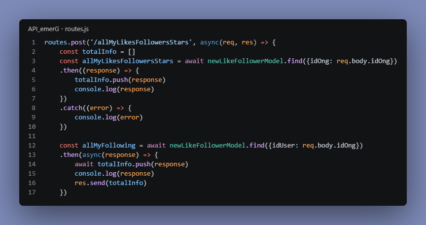

<div align="center">


# **Servidor emerG**

</div>


Este projeto foi desenvolvido em prol das **vitímas de desastres hidrológicos**, em todo o estado de São Paulo, como uma iniciativa de ação imediata aos mais vulneráveis, agindo em **cooperação com as Organizações Não Governamentais (ONGs)**.

Nossa RestAPI tem como objetivo **alimentar nossa plataforma online**, com diferentes tipos de dados, desde pontos onde entejam ocorrendo **enchentes** no estado de São Paulo, até postagens das ONGs em nossa **rede social**.

[Link da Aplicação]()



---
# 🛠️ ***Funcionalidades***

### USUÁRIOS
 - Resgate de todos os usuários cadastrados
 - Cadastro de um novo usuário
 - Verificação do usuário que está acessando a plataforma, identificando se seria uma ONG ou um usuário comum
### METAS
 - Criação de metas, por parte das ONGs, incentivando os usuários comuns a doarem para suas causas
### MARCAÇÕES
 - Resgate de todos os pontos de enchentes cadastrados
 - Cadastro de um novo ponto
### POSTAGENS
 - Resgate de todas as postagens feitas na rede social da emerG
 - Criação de uma nova postagem
 - Interação através de curtidas e avaliações
 - Seguir as instituições favoritas
### CHATS
 - Iniciar um bate-papo privado com a ONG

---
# 🗂️ ***Estrutura de pastas***

```
./
├── bd_access/
|   ├── bd_models
|   └── connectionMongoDB.js
├── images/   
├── node_modules/     
├── routes/        
|  
└── app.js
```

---
# 💡 ***Tecnologias***
 - **Node.js** - Ambiente de execução JavaScript
 - **Express.js** - Framework para Node.js
 - **Mongoose** - Biblioteca ODM (Object Data Modeling)
 - **Multer** - Biblioteca para upload de arquivos
---

# 🪧 ***Rotas***

Fluxo principal de como funciona a API integrada ao projeto.

 - POST - Cadastro de um novo usuário (comum)
```json
 {
   "cpf": "529.847.316-05",
   "nome": "Mariana Oliveira Santos",
   "email": "mariana.santos@example.com",
   "telefone": "+55 11 97777-4567",
   "senha": "Usuario@2026!",
   "endereco": "Rua das Palmeiras, 145 - Vila Mariana",
   "cep": "04101-000",
   "cidade": "São Paulo - SP",
   "foto": "https://example.com/users/mariana-oliveira.jpg",
   "descricao": "Moradora fictícia de São Paulo."
 }
```

 - POST - Cadastro de um novo usuário (ONG)
 ```json
 { 
   "ong_cnpj": "12.345.678/0001-90",
   "ong_name": "ONG Águas de São Paulo",
   "ong_email": "contato@aguasdesaopaulo.org",
   "ong_phone": "+55 11 98888-1234", 
   "ong_password": "Teste@Ong2026!",
   "ong_address": "Rua das Acácias, 250 - Mooca",
   "ong_cep": "03124-000",
   "ong_city": "São Paulo - SP",
   "ong_logo": "https://api-emer-g.vercel.app/downloadArchieve/aguas-de-sao-paulo.png",            
   "ong_description": "A ONG Águas de São Paulo é uma organização fictícia.",
   "ong_checked": true,
   "ong_niche": "Emergências, enchentes e assistência comunitária",
   "ong_stars": 4,
   "ong_likes": 327,
   "ong_followers": 1842,
   "ong_lat": -23.5535,
   "ong_lng": -46.6021
 }
 ```
 - POST - Verificação de dados para acesso na plataforma (login)
 ```json
 {
   "ong_password": "Usuario@2026!",
   "ong_email": "mariana.santos@example.com"
 }
 ```
 - GET - Resgate das informações sobre os pontos de enchente. Exemplo de retorno:
 ```json
 ...
 {
   "_id": "66e9f1a4c8b7d2e5f1234567",
   "id_flood": 4,
   "address": "Rua Fictícia das Águas, 100 - Mooca, São Paulo - SP",
   "userEmail": "usuario.ficticio@example.com",
   "userPhone": "+55 (11) 99999-0004",
   "userName": "João da Silva",
   "name": "Ponto de Enchente - Rua Fictícia das Águas",
   "floodLevel": 1,
   "lat": -23.5505,
   "lng": -46.6333
 }
 ...
 ```

 - POST - Criação de uma postagem (somente ONGs)
 ```json
 {
   "post_id_ong": 4,
   "post_ong_name": "ONG Águas de São Paulo",
   "post_ong_email": "contato@aguasdsaopaulo.org",
   "post_ong_logo": ".../downloadArchieve/logo_png",
   "post_image": "../downloadArchieve/565656566_png",            # Campo utilizado para resgate de imagens
   "post_documents": ".../downloadArchieve/565656566_pdf",        # Campo utilizado para resgate de documentos
   "post_documentsName": "Relatório de Ocorrência de enchente", 
   "post_description": "A ONG Águas de São Paulo está mobilizando voluntários para auxiliar moradores afetados pelas fortes chuvas na região de Carapicuíba."
 }
 ```

 - GET - Resgate e visualização das postagens. Exemplo de retorno:
 ```json
 ...
 {
  "_id": "66e9f1a4c8b7d2e5f1234567",
  "post_id_ong": 4,
  "post_ong_name": "ONG Águas de São Paulo",
  "post_ong_email": "contato@aguasdsaopaulo.org",
  "post_ong_logo": "https://api-emer-g.vercel.app/downloadArchieve/logo_png",
  "post_image": "https://api-emer-g.vercel.app/downloadArchieve/565656566_png",
  "post_documents": "https://api-emer-g.vercel.app/downloadArchieve/565656566_pdf",
  "post_documentsName": "Relatório de Ocorrência de enchente",
  "post_description": "A ONG Águas de São Paulo está mobilizando voluntários para auxiliar moradores afetados pelas fortes chuvas na região de Carapicuíba."
}
 ...
 ```

---

<div align=center>
    <p style="font-size: 25px">Obrigado por visitar meu projeto!!</p>
</div>

---